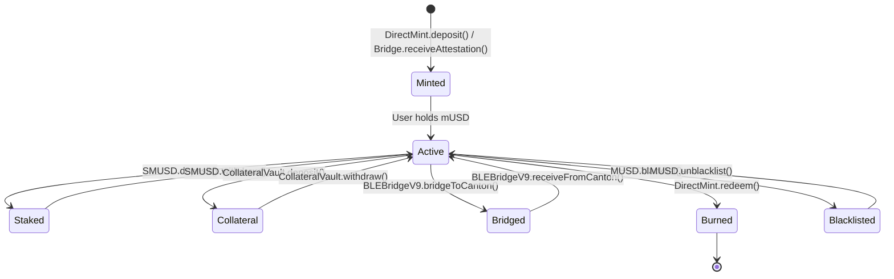
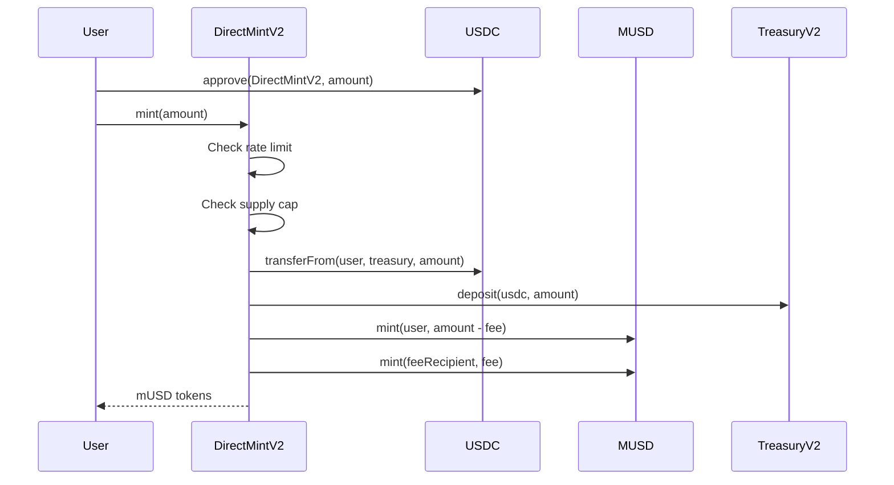
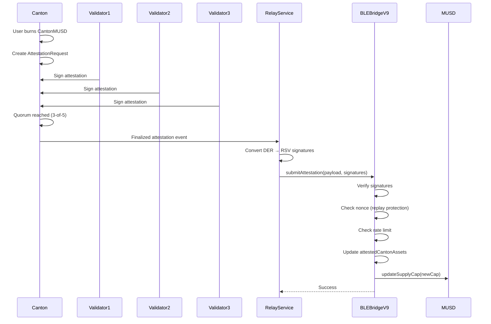
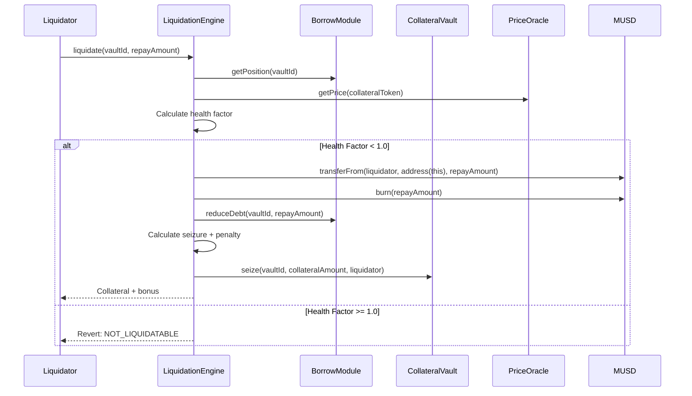
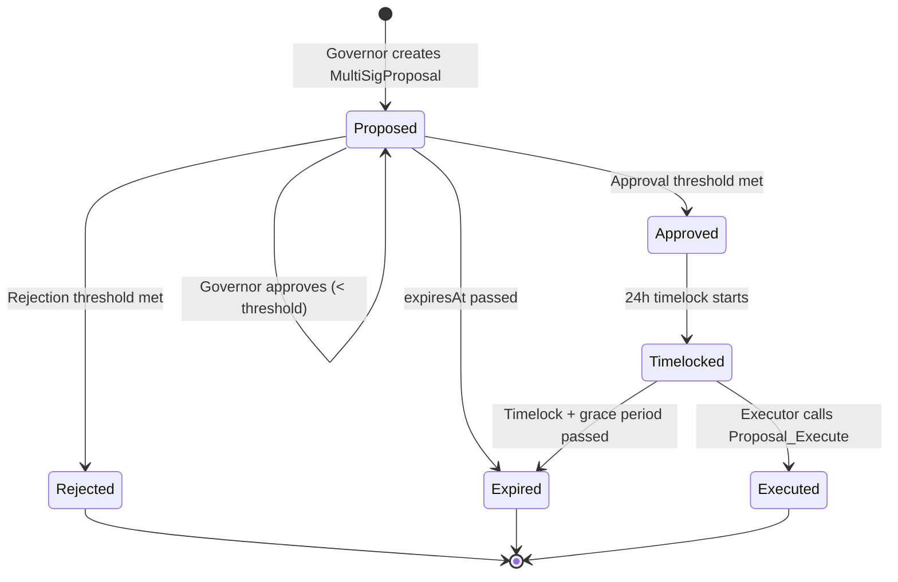
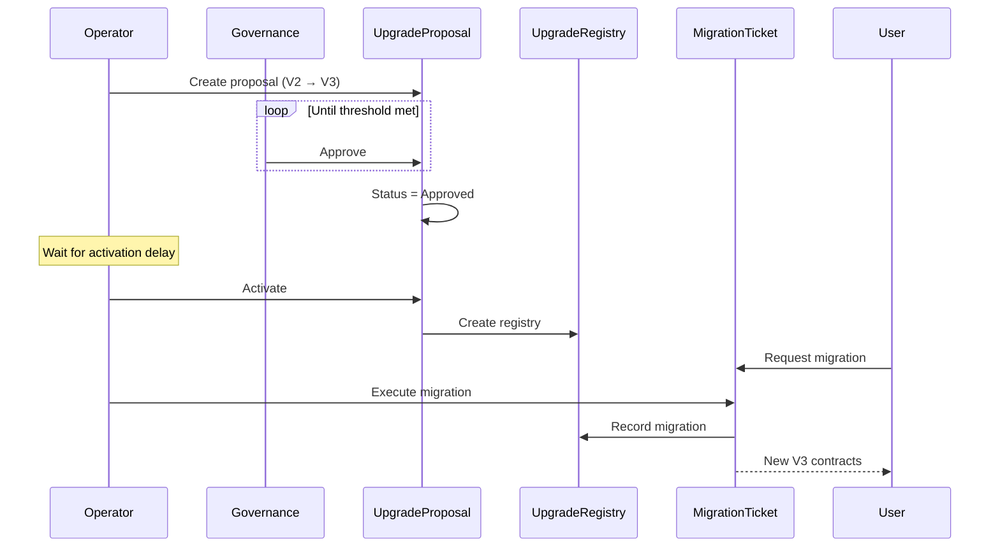
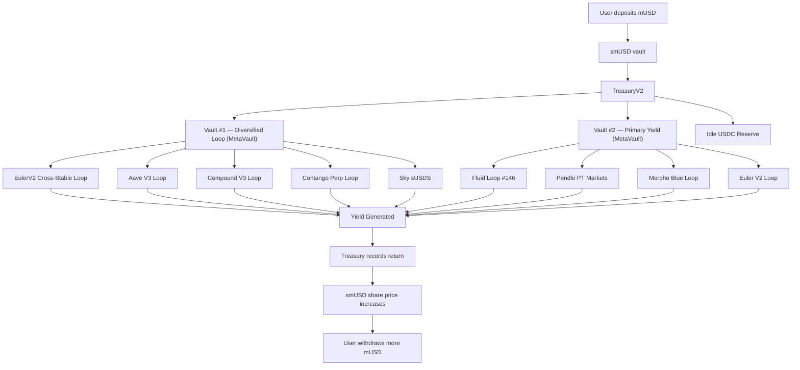
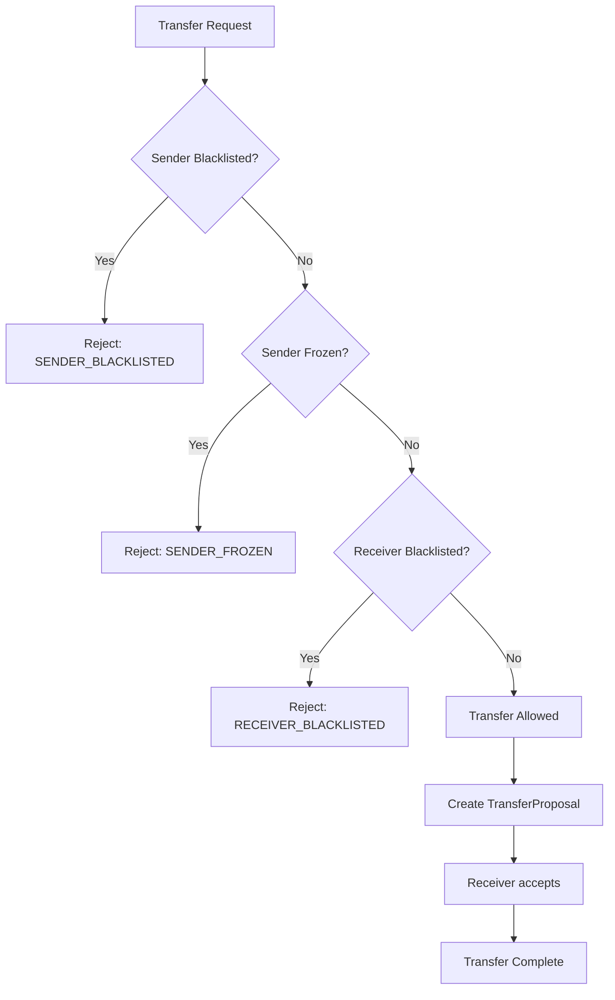
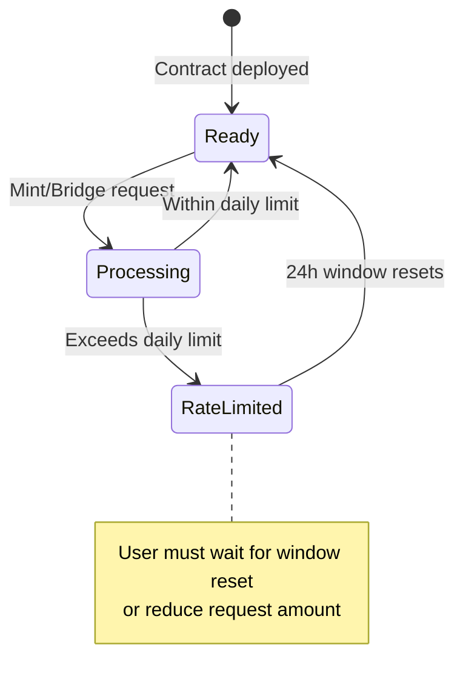
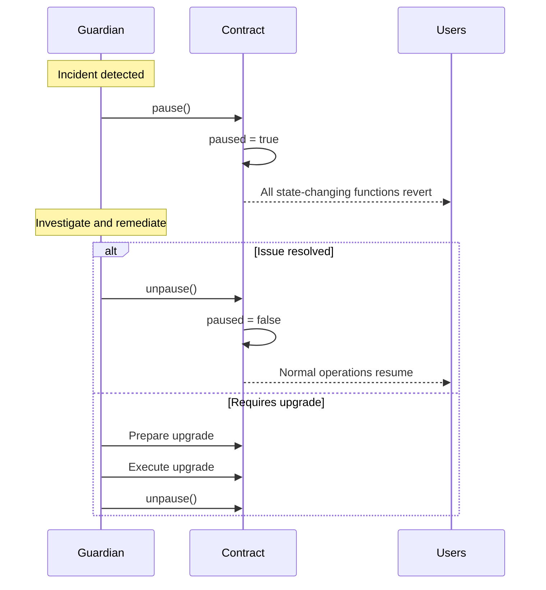

# Minted mUSD Protocol - State Machines & Flow Diagrams

This document contains Mermaid diagrams for the protocol's state machines and transaction flows.

---

## 1. mUSD Token Lifecycle



---

## 2. DirectMint Flow



---

## 3. Bridge Attestation Flow (Canton → Ethereum)



---

## 4. Vault Liquidation Flow



---

## 5. Governance Proposal Flow (DAML)



---

## 6. Contract Upgrade Flow (DAML)



---

## 7. smUSD Yield Flow (2-Vault Architecture)



---

## 8. Compliance Check Flow



---

## 9. Rate Limiting State Machine



---

## 10. Emergency Pause Flow



---

## Viewing These Diagrams

These Mermaid diagrams render automatically on:
- GitHub (in markdown files)
- VS Code with Mermaid extension
- Mermaid Live Editor: https://mermaid.live

For PDF export, use the Mermaid CLI:
```bash
npm install -g @mermaid-js/mermaid-cli
mmdc -i docs/DIAGRAMS.md -o docs/diagrams.pdf
```
